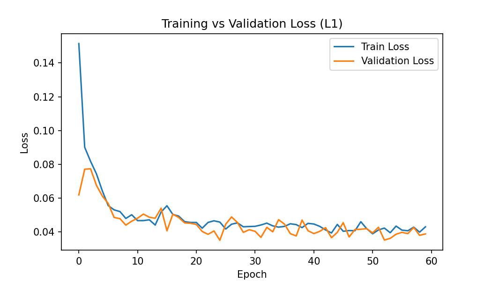
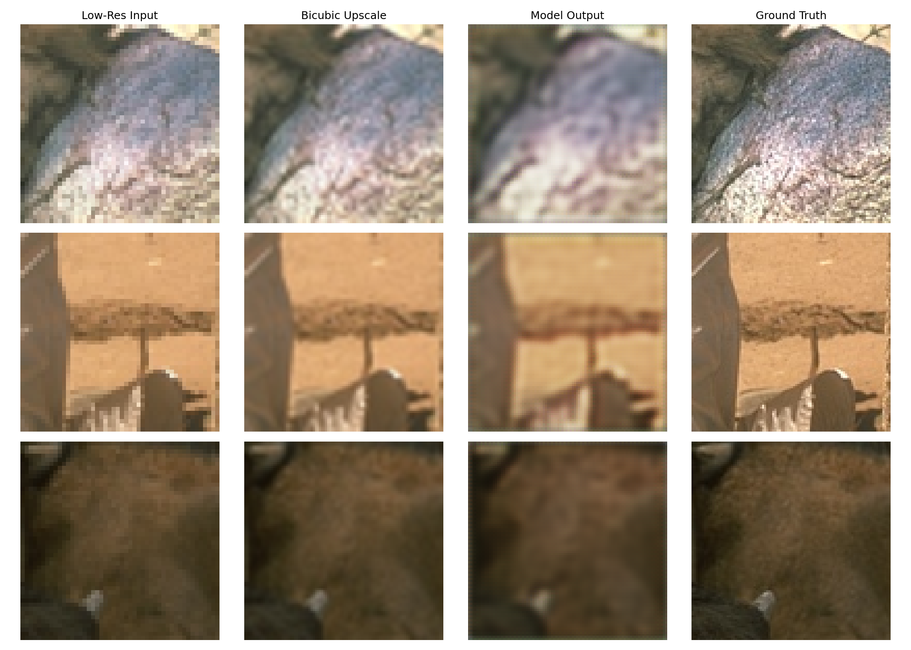

# Image Super-Resolution using ESPCN

A 2x image super-resolution model built with an efficient sub-pixel convolutional neural network (ESPCN), trained on the BSD100 dataset using PyTorch.

## Overview

This project trains a lightweight CNN to upscale low-resolution images by 2x, recovering detail that simple bicubic interpolation misses. ESPCN performs upsampling in the final layer using sub-pixel convolution (pixel shuffle), making it fast and efficient compared to upsampling early in the network.

## Dataset

- **Source:** BSD100 (Berkeley Segmentation Dataset), accessed via Hugging Face
- **Size:** 100 natural images (landscapes, animals, objects)
- Patches of 96x96 (HR) randomly cropped and downscaled to 48x48 (LR) for training

## Model Architecture

- ESPCN: 4 convolutional layers + PixelShuffle upsampling layer
- Loss function: L1 Loss
- Optimizer: Adam, learning rate 1e-3, step decay scheduler
- Trained for 60 epochs on a single GPU (Colab T4)

## Results

| Metric | Model | Bicubic Baseline |
|--------|-------|-------------------|
| PSNR (dB) | [insert value] | [insert value] |
| SSIM | [insert value] | — |

The model outperforms standard bicubic upscaling, recovering sharper edges and finer texture detail.

### Training vs Validation Loss

### Sample Predictions (Low-Res / Bicubic / Model Output / Ground Truth)

## Tech Stack

- Python, PyTorch
- scikit-image (PSNR/SSIM metrics)
- Matplotlib

## How to Run

1. Open the notebook in Google Colab
2. Run cells sequentially (GPU runtime recommended)
3. Dataset downloads automatically from Hugging Face's CDN

## Author

Aleena Kainat — AI/ML researcher working in applied deep learning and computer vision
